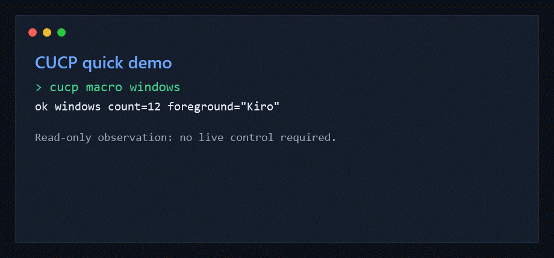

<div align="center">

# CUCP - Computer Use Control Plane

**A Windows GUI automation helper for AI agents that need to observe, ground,
act, and verify on the real desktop.**

[](https://learn.microsoft.com/windows/)
[](https://learn.microsoft.com/powershell/)
[](LICENSE)

[Install](#install) . [First Run](#first-run) . [Safety](#safety-model) . [Commands](#command-groups) . [Docs](#documentation)

</div>

---

## What CUCP Does

CUCP gives local AI agents one stable command, `cucp`, for Windows desktop
automation. It avoids blind pixel clicking by combining:

- Win32 window discovery and foreground detection
- UI Automation controls, names, roles, and invoke patterns
- OCR for visible text when UIA is incomplete
- Chrome DevTools Protocol for Chromium and Electron apps
- Explicit live-control gates before clicks, typing, shortcuts, or app changes

The core loop is simple:

```text
Observe -> Plan -> Act -> Verify
```

This repository is meant to be a reusable Windows automation layer, not a
project-specific desktop workflow dump.

Read-only commands can inspect the desktop. Live commands require
`-AllowLiveControl`, and coordinate-based actions are guarded by target-window
checks.

## Install

```powershell
git clone https://github.com/bagseunggwon30-cyber/Computer-Use-Control-Plane.git cucp
cd cucp
powershell -NoProfile -ExecutionPolicy Bypass -File .\install.ps1
```

The installer:

- checks for Windows and PowerShell 5.1+
- creates a user-scope `cucp.cmd` shim
- does not require admin rights
- verifies the wrapper with `health-quick`

Prefer not to install? Run the wrapper directly:

```powershell
powershell -NoProfile -ExecutionPolicy Bypass -File .\scripts\cucp.ps1 macro windows
```

To uninstall the shim, delete:

```text
%LOCALAPPDATA%\Microsoft\WindowsApps\cucp.cmd
```

## First Run

```powershell
# Read-only: list visible windows
cucp macro windows

# Read-only: find candidate controls by visible label
cucp macro find-label --label "Save" --explain

# Read-only: show wrapper/helper status
cucp version
cucp macro health-quick

# Live: click only after explicit live-control approval
cucp -AllowLiveControl macro smart-click --label "Save" --match "Notepad"
```



## Safety Model

CUCP is designed for local desktop control, so safety is part of the command
surface:

| Gate | Behavior |
|:--|:--|
| Live-control flag | Clicks, typing, shortcuts, app launch/close, and workflow execution are blocked unless `-AllowLiveControl` is present. |
| Target verification | Coordinate actions can require `--target-match` or `--target-hwnd` before input is sent. |
| Confidence floor | Low-confidence matches are rejected instead of guessed. |
| Sensitive action guard | Credential, payment, UAC, identity, destructive, and private-message screens are treated as stop conditions. |
| Audit trail | Live action attempts are recorded under the local temp CUCP directory. |
| Secret redaction | Logs and release-note helpers redact common token and private-key patterns. |

CUCP is not a UAC bypass tool, a credential entry tool, or a background malware
automation framework. It is a local operator helper for user-approved desktop
workflows.

## Command Groups

Common read-only commands:

```powershell
cucp macro windows
cucp macro find-label --label "Save" --explain
cucp macro list-affordances --window "Notepad" --limit 20
cucp macro screenshot --out-path .\screen.png
cucp macro health-quick
cucp macro log-tail --errors-only
```

Common planning and verification commands:

```powershell
cucp macro smart-plan --label "Save" --match "Notepad"
cucp macro workflow-plan --step "macro windows" --step "macro find-label --label Save"
cucp macro hit-test --x 1200 --y 720 --target-match "Notepad"
cucp macro target-validate --x 1200 --y 720 --target-match "Notepad"
cucp macro recovery-plan --failed-step "macro click-label --label Save"
```

Common live-control commands:

```powershell
cucp -AllowLiveControl macro click-label --label "Save" --match "Notepad"
cucp -AllowLiveControl macro fill-label --label "Name" --text "Alice"
cucp -AllowLiveControl macro shortcut --keys "ctrl+s"
cucp -AllowLiveControl macro smart-click --label "Save" --match "Notepad"
```

Chromium and Electron apps can opt into CDP routes when launched with a local
debugging port:

```powershell
cucp macro cdp-detect --port 9222
cucp macro cdp-deep-find --text "Send" --port 9222
cucp -AllowLiveControl macro cdp-smart-click --text "Send" --port 9222
```

See [references/command-reference.md](references/command-reference.md) for the
command reference and [references/cdp-setup.md](references/cdp-setup.md) for CDP
setup.

## Architecture

```text
scripts/cucp.ps1
  Public wrapper, safety gates, macro dispatch, JSON envelopes, audit logging.

scripts/cucp-native-helper.ps1
  Win32, UIA, OCR, screenshots, hit-test guards, CDP helper actions.

scripts/cucp-helper-server.ps1
  Optional resident helper for lower-latency repeated calls.

plans/
  Example typed desktop plans.

references/
  Command reference, CDP setup, troubleshooting, live verification helpers.

tests/
  Pester smoke and regression tests.
```

## Verification

Fast smoke suite:

```powershell
Invoke-Pester .\tests\cucp.Fast.Tests.ps1
```

Full regression suite:

```powershell
Invoke-Pester .\tests\cucp.Tests.ps1
```

Script parser check without Pester:

```powershell
$files = 'scripts\cucp.ps1','scripts\cucp-native-helper.ps1','scripts\cucp-helper-server.ps1'
foreach ($file in $files) {
  $tokens = $null
  $errors = $null
  [System.Management.Automation.Language.Parser]::ParseFile((Resolve-Path $file), [ref]$tokens, [ref]$errors) | Out-Null
  if ($errors.Count) { $errors | Format-List; exit 1 }
}
```

## Documentation

- [Command reference](references/command-reference.md)
- [CDP setup](references/cdp-setup.md)
- [Troubleshooting](references/troubleshooting.md)
- [Remaining work](references/remaining-work.md)

## Status

CUCP is Windows-first and PowerShell-based. Some commands work as pure wrapper
logic; others need desktop access, UI Automation, OCR language packs, a running
Chromium debugging port, or the optional helper server. When a capability is not
available, commands should return an explicit envelope with `status`, exit code,
and a recoverable error instead of silently guessing.

## License

No license file is currently published on `main`. Add a license before treating
this repository as open-source redistributable software.
